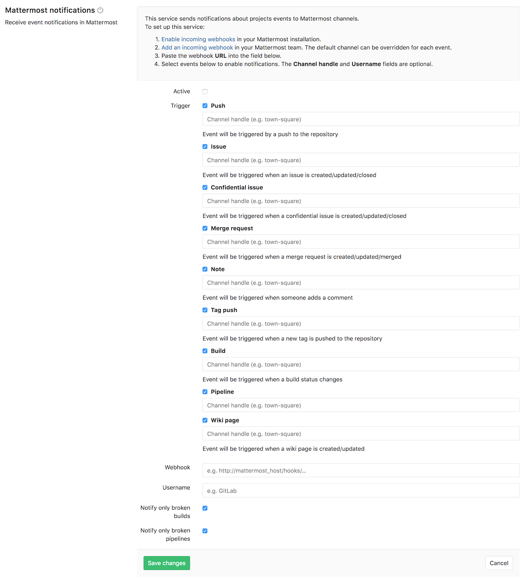

# Mattermost Notifications Service

## On Mattermost

To enable Mattermost integration you must create an incoming webhook integration:

1. Sign in to your Mattermost instance
1. Visit incoming webhooks, that will be something like: https://mattermost.example/your_team_name/integrations/incoming_webhooks/add
1. Choose a display name, description and channel, those can be overridden on GitLab
1. Save it, copy the **Webhook URL**, we'll need this later for GitLab.

There might be some cases that Incoming Webhooks are blocked by admin, ask your mattermost admin to enable
it on https://mattermost.example/admin_console/integrations/custom.

Display name override is not enabled by default, you need to ask your admin to enable it on that same section.

## On GitLab

After you set up Mattermost, it's time to set up GitLab.

Navigate to the [Integrations page](project_services.md#accessing-the-project-services)
and select the **Mattermost notifications** service to configure it.
There, you will see a checkbox with the following events that can be triggered:

- Push
- Issue
- Confidential issue
- Merge request
- Note
- Tag push
- Build
- Pipeline
- Wiki page

Below each of these event checkboxes, you have an input field to enter
which Mattermost channel you want to send that event message. Enter your preferred channel handle (the hash sign `#` is optional).

At the end, fill in your Mattermost details:

| Field | Description |
| ----- | ----------- |
| **Webhook**  | The incoming webhook URL which you have to setup on Mattermost, it will be something like: http://mattermost.example/hooks/5xo… |
| **Username** | Optional username which can be on messages sent to Mattermost. Fill this in if you want to change the username of the bot. |
| **Notify only broken builds** | If you choose to enable the **Build** event and you want to be only notified about failed builds. |
| **Notify only broken pipelines** | If you choose to enable the **Pipeline** event and you want to be only notified about failed pipelines. |

